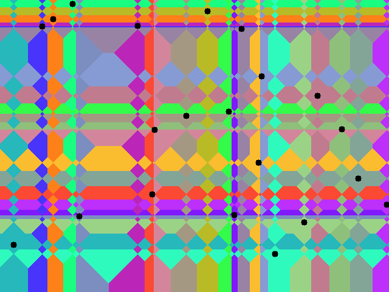

# Experimenting with Voronoi Diagrams in C

## Using Euclidean distance

## Using Manhattan distance

## Using Chebyshev distance

## Using Minkowski distance

See also the MP4 videos in the samples folder.

